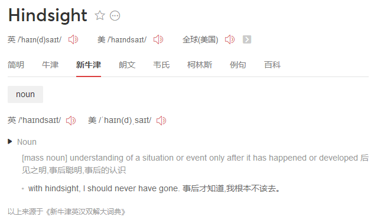
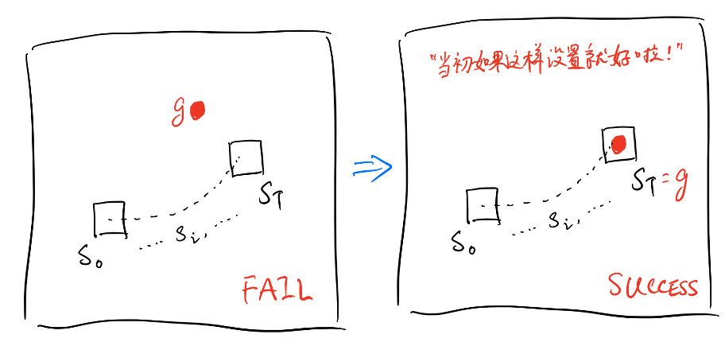
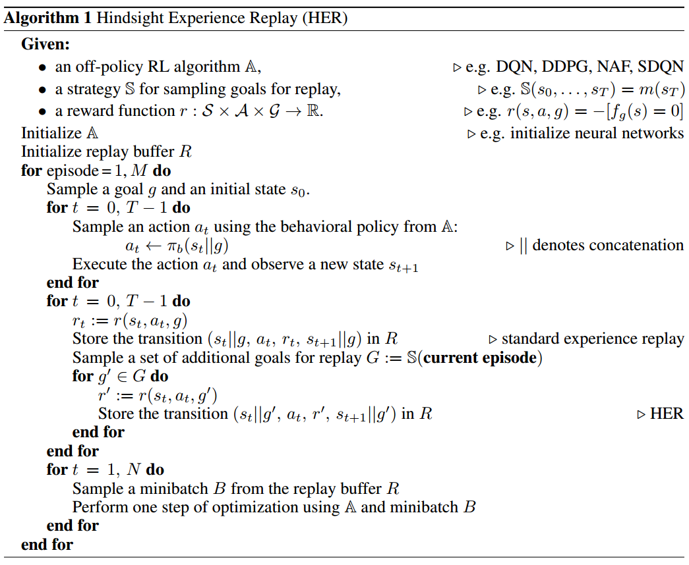
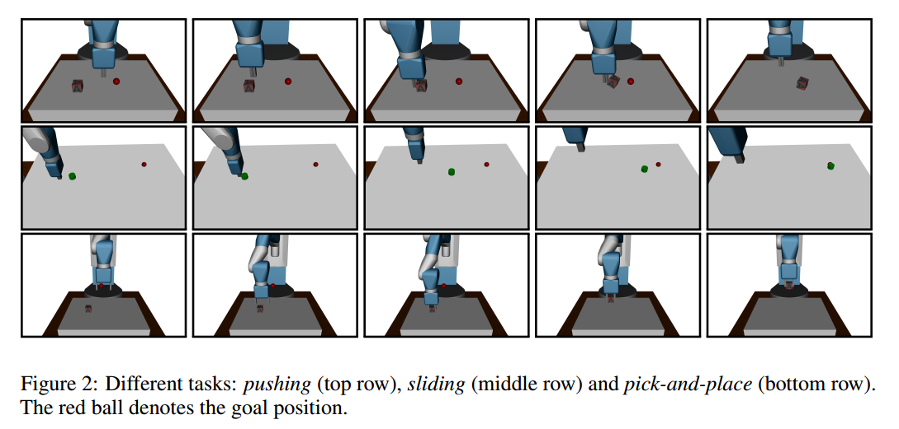
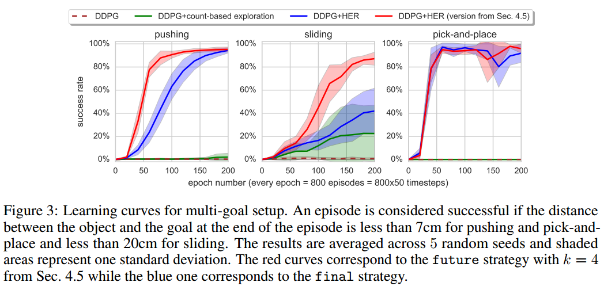
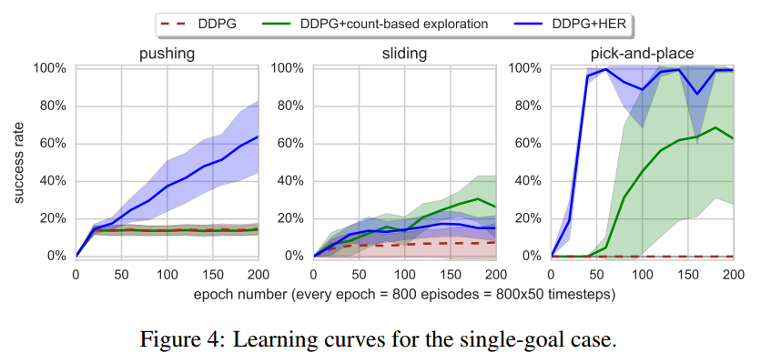
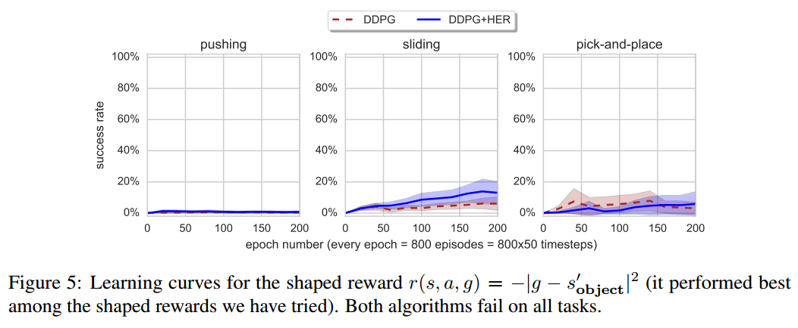
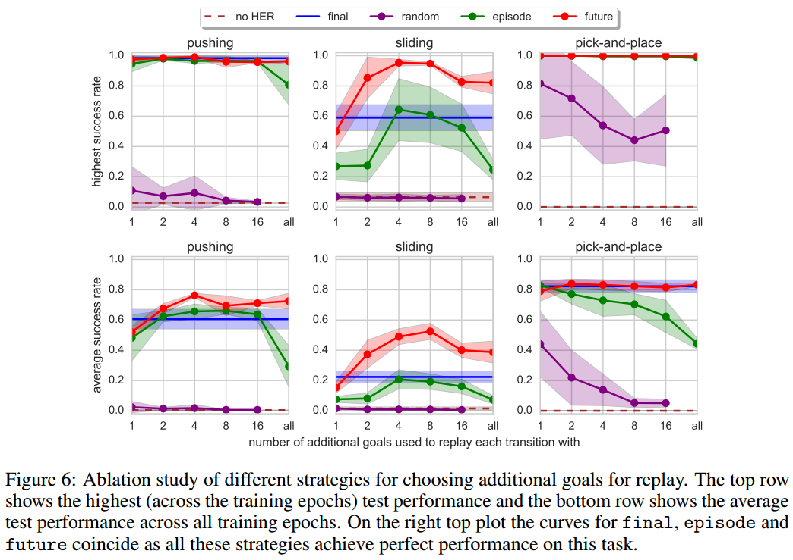

本文介绍了一个“事后诸葛亮”的经验池机制，简称为**HER**，它可以很好地应用于**稀疏奖励**和**二分奖励**的问题中，不需要复杂的奖励函数工程设计。

推荐：

- 稀疏奖励问题的一种解决方案
- 通俗易懂

<!--more-->

# 简介

论文地址：[https://papers.nips.cc/paper/7090-hindsight-experience-replay.pdf](https://papers.nips.cc/paper/7090-hindsight-experience-replay.pdf)

>Dealing with sparse rewards is one of the biggest challenges in Reinforcement Learning (RL).  

强化学习问题中最棘手的问题之一就是稀疏奖励。

本文提出了一个新颖的技术：Hindsight Experience Replay（HER），可以从稀疏、二分的奖励问题中高效采样并进行学习，而且可以应用于**所有的Off-Policy**算法中。

Hindsight意为事后，结合强化学习中序贯决策问题的特性，我们很容易就可以猜想到，“事后”要不然指的是在状态s下执行动作a之后，要不然指的就是当一个episode结束之后。其实，文中对常规经验池的改进也正是运用了这样的含义。

> HER lets an agent learn from undesired outcomes and tackles the problem of sparse rewards in Reinforcement Learning (RL).——Zhao, R., & Tresp, V. (2018). Energy-Based Hindsight Experience Prioritization. *CoRL*.

HER使智能体从没达到的结果中去学习，解决了强化学习中稀疏奖励的问题。

## 二分奖励 binary reward

简言之，完成目标为一个值，没完成目标为另一个值。如：

- $S_{T}=Goal，r=0$
- $S\neq Goal, r=-1. for \ S \in \mathbb{S}$

## 稀疏奖励 sparse reward

简言之，完成目标的episode太少或者完成目标的步数太长，导致负奖励的样本数过多

# 文中精要

在机器人领域，要想使强化学习训练它完美执行某任务，往往需要设计合理的奖励函数，但是设计这样的奖励函数工程师不仅需要懂得强化学习的领域知识，也需要懂得机器人、运动学等领域的知识。而且，有这些知识也未必能设计出很好的奖励函数供智能体进行学习。因此，如果可以从简单的奖励函数（如二分奖励）学习到可完成任务的模型，那就不需要费心设计复杂的奖励函数了。

文中介绍了一个例子来引入HER：

- 名称：bit-flipping environment
- 状态空间$\mathcal{S}=\left \{ 0,1 \right \}^{n}$
- 动作空间$\mathcal{A}=\left \{ 0,1,\cdots,n-1 \right \}$
- 规则：对于每个episode，均匀采样长度为$n$的初始状态$s_{0}$（如$n=5，s_{0}=10101$）和目标状态$s_{g}$，每一步从动作空间中选取一个动作$a$，翻转$s_{0}$第$a$个位置的值，如$a=1\Rightarrow s_{1}=11101$，直到回合结束或者翻转后的状态与$s_{g}$相同
- 奖励函数：$r_{g}(s,a)=-\left [ s \neq g \right ]$，即达到目标状态则为0，未达到目标状态则为-1。这个很容易理解，$s \neq g \Rightarrow true \doteq 1，s = g \Rightarrow false \doteq 0$

*注：下文如无特殊说明，$g$即表示目标状态$s_{g}$*

> Standard RL algorithms are bound to fail in this environment for n > 40 because they will never experience any reward other than -1. Notice that using techniques for improving exploration (e.g. VIME (Houthooft et al., 2016), count-based exploration (Ostrovski et al., 2017) or bootstrapped DQN (Osband et al., 2016)) does not help here because the real problem is not in lack of diversity of states being visited, rather it is simply impractical to explore such a large state space.  

当序列长度$n$大于40时，传统的强化学习算法就算有各种探索机制的加持，也不能学会解决这个问题，因为这个问题完全不是缺乏探索，而是**状态太多，探索不完**，导致奖励极其稀疏，算法根本不知道需要优化的目标在哪里。

为了解决这个问题，作者指出了两个思路：

1. 使用shaped reward（简言之，将reward设计成某些变量的函数，如$r_{g}(s,a)=-\left || s-g \right ||^{2}$，即奖励函数为当前状态与目标状态的欧氏距离的负数），将训练的算法逐步引导至奖励函数增大的决策空间。但是这种方法可能很难应用于复杂的问题中。
2. 使用HER——事后经验池机制

## HER

> The pivotal idea behind our approach is to re-examine this trajectory with a different goal — while this trajectory may not help us learn how to achieve the state g, it definitely tells us something about how to achieve the state $s_{T}$ .

HER的主要思想就是：**为什么一定要考虑我们设定的目标呢？假设我们想让一个智能体学会移动到某个位置，它在一个episode中没有学到移动到目标位置就算失败吗？假定序列为$s_{0},s_{1},s_{2}, \cdots ,s_{T}$，目标为$g$，我们何不换一种思路考虑：如果我们在episode开始前就将目标状态$g$设置为$s_{T}$，即$g=s_{T}$，那么这样看来智能体不就算是完成目标了吗？**

HER就是运用了这个思想对经验池进行了扩充，将稀疏奖励问题给转化成非稀疏奖励，大大的扩展了经验池中完成任务的经验数量。

HER主要特点：

- 传统经验池存入的是状态$s$，而HER存入的是$s||g$，也就是`tf.concat(s,g)`
- 训练算法的输入也是$s||g$，也就是需要在当前状态后边连结上**每个episode的**目标状态，每个episode的目标状态可能不同
- HER对经验池进行了扩充，不仅存入实际采样得到的transition/experience，$\left ( s_{t}||g,a_{t},r_{t},s_{t+1}||g \right )$，也要在回合结束时**重新设置目标状态**，得到相应的奖励值（在二分奖励问题中，只有在$s=g$时奖励才需要更改），存入“事后”（当初如果这样就好啦！）的经验$\left ( s_{t}||g',a_{t},r_{t}',s_{t+1}||g' \right )$，详见伪代码，这个事后经验究竟存入多少份、多少种，由超参数$k$控制，下文讲解。
- HER更适合解决多目标问题，多目标的意思为，目标点非固定，每个episode的目标状态可以不相同。详见实验部分

HER的几种扩展方式：

> future — replay with k random states which come from the same episode as the transition being replayed and were observed after it,
> episode — replay with k random states coming from the same episode as the transition being replayed,
> random — replay with k random states encountered so far in the whole training procedure.

- 未来模式——future：在一个序列$s_{0},s_{1},s_{2},\cdots,s_{T}$中，如果遍历到状态$s_{2}$，则在$s_{3},\cdots,s_{T}$之间随机抽取$k$个状态作为目标状态$g'$，并依此向经验池中存入$\left ( s_{2}||g',a_{2},r_{2}',s_{3}||g' \right )$，**特点：一个episode的后续部分**
- 回合模式——episode：在一个序列$s_{0},s_{1},s_{2},...,s_{T}$中，如果遍历到状态$s_{2}$，则在整个序列中随机抽取$k$个状态作为目标状态$g'$，并依此向经验池中存入$\left ( s_{2}||g',a_{2},r_{2}',s_{3}||g' \right )$，**特点：一个episode**

- 随机模式——random：在一个序列$s_{0},s_{1},s_{2},...,s_{T}$中，如果遍历到状态$s_{2}$，则在多个序列$\tau_{0},\tau_{1},\tau_{2},\cdots$中随机抽取$k$个状态作为目标状态$g'$，并依此向经验池中存入$\left ( s_{2}||g',a_{2},r_{2}',s_{3}||g' \right )$，**特点：多个episode**

- 最终模式——final：在一个序列$s_{0},s_{1},s_{2},\cdots,s_{T}$中，如果遍历到状态$s_{2}$，则之间令$g'=s_{T}$，并向经验池中存入$\left ( s_{2}||g',a_{2},r_{2}',s_{3}||g' \right )$，**特点：一个episode的最后一个状态，如果设置k，则存入k个相同的经验**

## 伪代码

解析：

1. 伪代码中没有提到超参数$k$，其实在循环条件$\textbf{for} \ g' \in G \ \textbf{do}$中循环执行了$k$次
2. $||$操作为连结操作，简言之，将两个长度为5的向量合并成一个长度为10的向量
3. $G:=\mathbb{S}(\textbf{current episode})$即为上文提到的四种扩展模式：future、episode、random、final。
4. 奖励函数$r(s,a,g)=-\left [ f_{g}(s)=0 \right ]$即为前文提到的$r_{g}(s,a)=-\left [ s \neq g \right ]$，即完成为0，未完成为-1，具体奖励函数可以根据我们的使用环境设计
5. $a_{t} \leftarrow \pi_{b}(s_{t}||g)$表示神经网络的输入为当前状态与目标状态的连结

## HER的优点

1. 可解决稀疏奖励、二分奖励问题
2. 可适用于所有的Off-Policy算法
3. 提升了数据采样效率

# 实验部分

文中实验结果：[https://goo.gl/SMrQnI](https://goo.gl/SMrQnI)

实验部分的完整细节请参考论文原文。

## 环境

- 7自由度机械臂
- 模拟环境：MuJoCo
- 任务分为3种
  - Pushing，推：锁定机械臂的钳子，移动机械臂将物体推到目标点
  - Sliding，滑动：类似于冰球运动，锁定机械臂的钳子，移动机械臂给与物体一个力，使物体可以在较光滑的桌面上滑动并且达到目标位置
  - Pick-and-place，摆放：解锁钳子，使用机械臂夹起物体并移动至空中目标点

## 算法

- DDPG
- Adam优化器
- 多层感知机MLPs
- ReLU激活函数
- 8核并行，更新参数后取平均
- A-C网络都是3个隐藏层，每层64个隐节点，Actor输出层用tanh激活函数
- 经验池大小为$10^{6}$，折扣因子$\gamma=0.98$，学习率$\alpha=0.001$，探索因子$\epsilon = 0.2$

> With probability 20% we sample (uniformly) a random action from the hypercube of valid actions. 

DDPG使用了随机探索机制

## 训练结果

### final模式与future模式对比

- 红色曲线为future模式，蓝色曲线为final模式，绿色曲线为使用了[count-based](https://arxiv.org/pdf/1703.01310.pdf)的DDPG，褐红色虚线为原始DDPG
- 从左至右依次是Pushing，Sliding，Pick-and-place任务
- 超参数$k=4$
- 这个实验中，目标状态会变，即为多个目标状态

结果分析：

- future模式比final效果更好
- 使用了count-based的DDPG智能稍微解决一下Sliding任务
- 使用HER的DDPG可以完全胜任三个任务
- 证明了HER是使从稀疏、二分奖励问题中学习成为可能的关键因素

### 单个目标状态的实验

- 蓝色曲线为使用了HER的DDPG，文中并未说明HER是哪种模式，**猜测**是final模式，因为文中实验部分之前都是以final模式进行举例
- 绿色曲线代表应用了count-based的DDPG，褐红色虚线为原始DDPG
- 实验中，目标状态都为同一状态$g$

结果分析：

- DDPG+HER比原始DDPG的性能要好很多
- **相比于多个目标的实验，可以发现，在多目标的任务中DDPG训练更快**，所以在实际中，即使我们只关心一个目标，我们最好也使用多个目标来训练

### HER应用于reward shaping问题中

前文已经说过，reward shaping可以简单理解为将奖励函数设置为某些变量的函数，如$r_{g}(s,a)=-\left || s-g \right ||^{2}$，即奖励函数为当前状态与目标状态的欧氏距离的负数

- 奖励函数为$r_{g}(s,a)=-\left || s-g \right ||^{2}$

结果分析：

- 无论使用怎样的reward shaping函数，DDPG、DDPG+HER都不能解决这个问题

- 作者认为原因有二：

  - > There is a huge discrepancy between what we optimize (i.e. a shaped reward function) and the success condition (i.e.: is the object within some radius from the goal at the end of the episode);  
  
    判定完成目标的条件和要优化的问题有巨大的矛盾（虽然我也不理解这到底是什么意思，索性就直接抄了过来）
  
  - > Shaped rewards penalize for inappropriate behaviour (e.g. moving the box in a wrong direction) which may hinder exploration. It can cause the agent to learn not to touch the box at all if it can not manipulate it precisely and we noticed such behaviour in some of our experiments. 
  
    reward shaping阻碍了探索
  
- > Our results suggest that domain-agnostic reward shaping does not work well (at least in the simple forms we have tried). Of course for every problem there exists a reward which makes it easy (Ng et al., 1999) but designing such shaped rewards requires a lot of domain knowledge and may in some cases not be much easier than directly scripting the policy. This strengthens our belief that learning from sparse, binary rewards is an important problem. 

  研究结果表明，与领域无关的reward shaping效果并不好

### 四种模式比较

- 红色代表future模式，蓝色代表final模式，绿色代表episode模式，紫色代表episode模式，褐红色虚线代表原始DDPG
- 横坐标代表超参数$k$，第一行三个图的纵坐标代表最高得分，第二行三个图的纵坐标代表平均得分

结果分析：

- 效果：future>final>episode>random>no HER

- 稳定性：final(好)=no-HER(差)>future>episode>random

- future模式是唯一一个可以解决Sliding任务的，在$k=4$或者$k=8$时效果最好

- 增大$k$超过8会使性能有所下降，主要是因为$k$过大导致经验池中原始真实数据所占的比例太小

- > It confirms that the most valuable goals for replay are the ones which are going to be achieved in the near future 

  它证实了回放经验中最有价值的目标是那些在不久的将来能实现的目标

*注：作者根据 future 模式提出了最近邻的 future 模式，即把$g'$设置为$s_{t+1}$，并且进行了实验，实验结果不如 future 模式。*