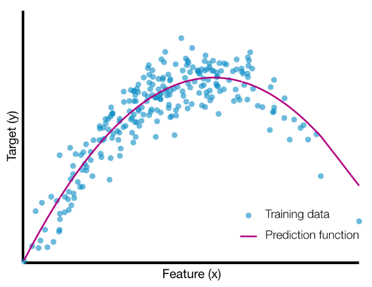
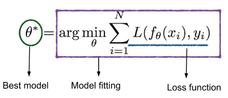
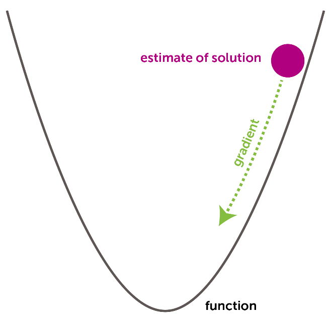
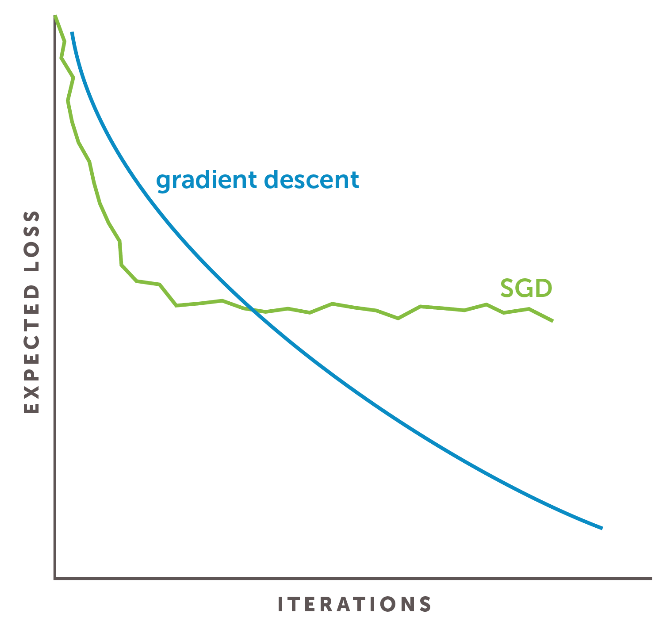
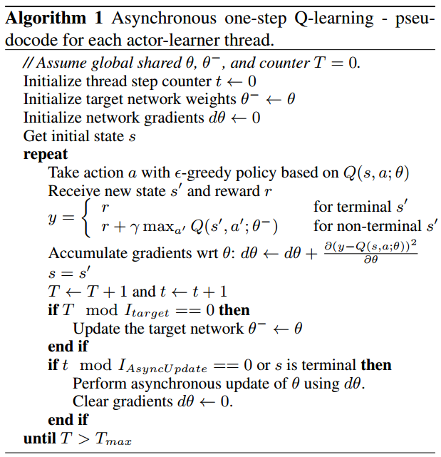
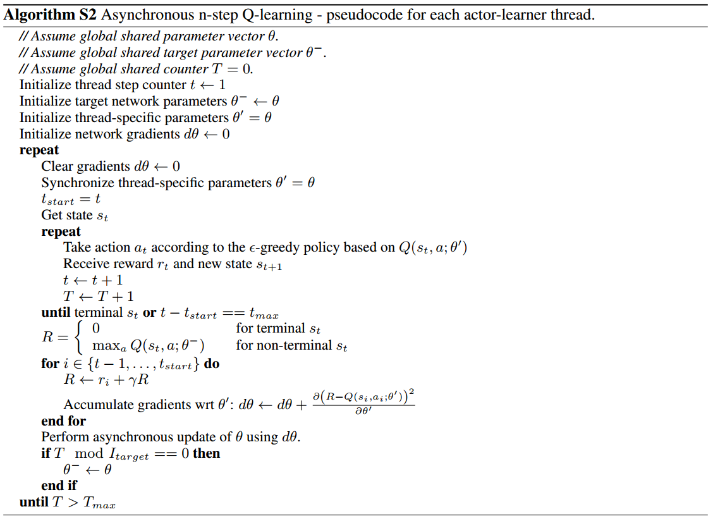
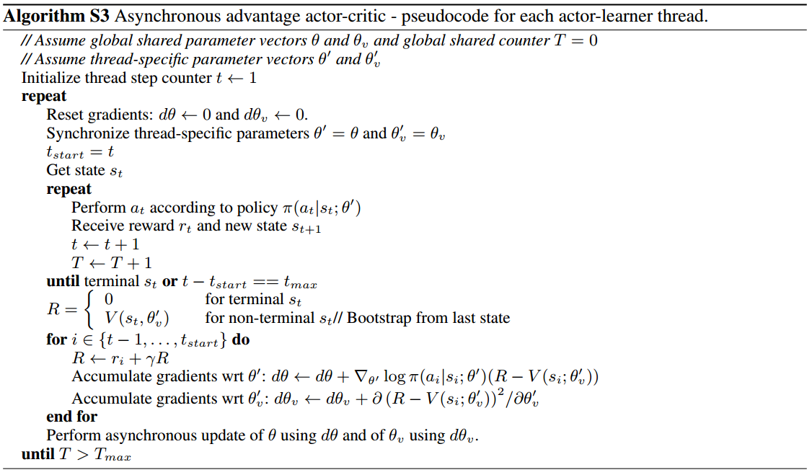

本文提出了A3C模型，即Asynchronous Advantage Actor-Critic，是A2C的异步版本，使用CPU多核而不用GPU进行训练，文中说效果比使用GPU反而更好。

推荐：

- 并行梯度优化的佳作
- 通俗易懂

<!--more-->

# 简介

论文地址：[https://arxiv.org/pdf/1602.01783.pdf](https://arxiv.org/pdf/1602.01783.pdf)

本文提出了一个概念简单、异步梯度优化的轻量级深度强化学习训练框架。提出该框架的初衷是占用少的资源稳定深度神经网络的学习。

效果：

- 稳定训练
- 在Atari游戏上相比当时最先进的算法，使用一个多核CPU比使用GPU训练时间减半
- 成功适用于很多连续运动学控制问题，例如图像输入的3D迷宫

> the sequence of observed data encountered by an online RL agent is non-stationary, and on-line RL updates are strongly correlated. By storing the agent’s data in an experience replay memory, the data can be batched or randomly sampled from different time-steps. Aggregating over memory in this way reduces non-stationarity and decorrelates updates, but at the same time limits the methods to off-policy reinforcement learning algorithms 

文中指出，on-policy方法训练不稳定，数据相关性很强，off-policy机制结合经验池机制减轻了训练的不稳定性和数据相关性。

经验池的缺点：

1. 占用内存，增加计算量
2. 需要off-policy算法

本文为深度强化学习提供了一个非常不同的范例，不使用经验池机制，而使用异步并行的方法在多个**相同环境**中执行多个智能体。（同时训练多个不同环境没有进行描述和实验）

这种异步并行方式的优点是：

1. 实现减轻数据相关性的效果，使训练稳定
2. 可用于大范围on-policy算法，如Sarsa，n-step方法，A-C方法，也可用于off-policy方法，如Q-learning
3. 利用深度神经网络设计算法，保持鲁棒性与有效性（不予置评）
4. 不使用GPU，只使用多核CPU，反而训练时间短
5. 比大规模分布式需要更少的资源占用（内存、算力等）
6. **相比于[Gorila](https://arxiv.org/pdf/1507.04296.pdf)异步训练方式，本文中的训练方式不需要中心服务器，其使用的是共享内存模式**
7. 单机运行减少了通信（梯度和超参数）的开销

# 文中精要

由于本文思想非常简单，所以精简描述论文精华

本文使用**[Hogwild!](https://arxiv.org/pdf/1106.5730.pdf)**方式进行异步梯度下降

Hogwild! 这个方法的提出也很偶然，容我步步道来：

我们使用函数对样本集进行拟合如下图所示

当我们想要判断函数是否拟合的不错，我们往往使用损失函数来衡量，损失越小，则代表函数拟合得越好（但，过拟合不是我们想要的）。

为了减小损失，我们常用梯度下降算法来优化。标准的梯度下降原理如下图所示，如果函数为凸函数，且更新步长很小，那么在有限步长内总可以下降至函数最小点，即，获得使损失函数最小的参数$\theta^{\ast}$

之后出现了SGD，也就是随机梯度下降，这种方法差不多在60年代提出，由于思想过于简单，迭代次数很长，一直不被主流优化算法接受。但是，当大数据时代到来时，SGD变成了很普遍的优化方法。

SGD的算法流程如下：

- 选一个初始参数向量$\theta$和正步长$\alpha$
- 循环直到满足结束条件：
  - 从训练集中随机选择一个样本$x_{i}$
  - 更新参数$\theta \leftarrow\left(\theta-\alpha \nabla L\left(f_{\theta}\left(x_{i}\right), y_{i}\right)\right)$

SGD的优点：

1. 少内存占用。SGD不需要所有的样本集进行计算梯度，只需要从样本集中抽取一个样本进行训练。频繁的采样操作可以使用高速缓存来加速训练。
2. 收敛至**可接受的解**速度很快。其实我们不希望看到过拟合，当然也不希望看到欠拟合，SGD正好是这两个极端的trade-off。SGD可以很快的收敛到一个较好的解，相对于样本集较好的解比相对于样本集最好的解的泛化能力可要强得多。下图展示了SGD与标准梯度下降的损失函数曲线比较。

看图像可能会觉得SGD并没有严格下降，有时会有损失上升的倾向，但是，总体来看，这种方法最终也是可以收敛到最小值的。总体上，它使损失进行了下降。

对于熟悉并行编程的人来说，如果让他们设计并行随机梯度下降，他们一定会像这样设计：

- 每个线程从训练集随机抽取一个样本$x_{i}$
  - 锁参数$\theta$
  - 线程读参数$\theta$
  - 线程更新参数$\theta \leftarrow\left(\theta-\alpha \nabla L\left(f_{\theta}\left(x_{i}\right), y_{i}\right)\right)$
  - 解锁

更新前锁定参数，更新后解锁参数。对于许多问题，更新这一步骤耗时在微秒级，而锁参数耗时在毫秒级，这意味着锁参数要比更新多占用1000多倍的时间。虽然有一些其他方法可以对该过程进行优化，但差距还是很明显。

如果，**注释掉关于锁的代码呢？**这真是一个大胆的想法，但是Hogwild!就是这么做的。（这都是一个叫Feng Niu的人搞出来的，不知是出于好奇还是在Debug，他在研究加速SGD的时候注释掉了锁的代码，算法不仅有效，还提升了一百多倍。所以说，多试试总是好的。。。）流程如下：

- 每个线程从训练集随机抽取一个样本$x_{i}$
  - ~~锁参数$\theta $~~​
  - 线程读参数$\theta$
  - 线程更新参数$\theta \leftarrow\left(\theta-\alpha \nabla L\left(f_{\theta}\left(x_{i}\right), y_{i}\right)\right)$
  - ~~解锁~~

> In a sentence, the main idea of Hogwild! is — “**Remove all thread locks from parallel SGD code**.” In Hogwild!, threads can overwrite each other by writing at the same time and compute gradients using a stale version of the “current solution.” 

我们不禁都有一个疑问，这么做，真的可以吗？还真别说，经过实验表明，该方法取得了多线程的益处却没有数学效率上的负面影响。

本文中的异步更新就是用这种方法，唯一有问题的可能就是两个线程同写，但是即便是同写，写入还是有先后的，最多也就是把前一个线程写入的给覆盖掉，丢弃一个线程的数据更新而已，无伤大雅，至于多个线程写后读、读后写倒都没有大的影响，不影响参数更新与收敛。

## 伪代码

**本文中所有伪代码都使用Hogwild!方式进行梯度更新。**

以下伪代码都是单个线程中actor-learning的操作。每个线程中的actor可以使用不同的探索机制，实验证明不同的探索机制可以提高算法的鲁棒性和性能效果。

首先介绍异步one-step Q-Learning的训练模式

解析：

- 相比后两个伪代码，该代码中各线程是不需要复制用于选择动作的训练网络（因为各方对target network的定义不同，有些人认为等待赋值的是目标网络，有些人认为需要训练的是目标网络，因此，此处不使用目标网络的术语）的，即每次选择动作，都使用其他线程可能更新过的Q网络进行决策。这是因为不需要使用同一个决策模型向后看多步
- $\theta$是动态变化的，即在该线程的训练过程中，其他线程也可能对参数$\theta$进行了更新
- $I_{target}$代表双Q学习赋值的间隔
- $I_{AsyncUpdate}$代表单线程对共享参数$\theta$更新的间隔

---

接下来是异步n-step Q-Learning的训练模式：

相比于n-step，one-step方法中获得的立即奖励$r$只影响导致其产生的$Q(s,a)$，从而通过$Q(s,a)$间接影响其他的动作值，这会使训练过程很慢，因为需要多次更新才能将奖励传播到前面的相关状态和动作。使奖励传播更快的一个方法就是使用n-step回报。
$$
G_{t}=r_{t}+\gamma r_{t+1}+\cdots+\gamma^{n-1} r_{t+n-1}+\max _{a} \gamma^{n} Q\left(s_{t+n}, a\right)
$$

解析：

- 相比于one-step，该算法为每个线程配置了一个备份网络$\color{red}{\theta'}$
- $t_{max}$为n-step中的$n$

---

最后是异步A2C，即A3C的训练模式：

解析：

- $t_{max}$为n-step向前看的步数
- 文中针对该模型将A-C网络架构共享了部分神经网络参数，并且对actor网络的损失函数公式进行了改造：$\nabla_{\theta^{\prime}} \log \pi\left(a_{t} | s_{t} ; \theta^{\prime}\right)\left(R_{t}-V\left(s_{t} ; \theta_{v}\right)\right)+\color{red}{\beta \nabla_{\theta^{\prime}} H\left(\pi\left(s_{t} ; \theta^{\prime}\right)\right)}$，即添加了熵正则化项，它的作用是增加探索，避免网络过早地收敛至局部最优，$\beta$为超参数

# 引用

> [Parallel Machine Learning with Hogwild!](https://medium.com/@krishna_srd/parallel-machine-learning-with-hogwild-f945ad7e48a4)