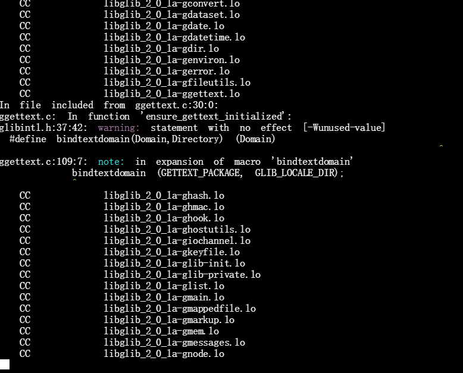
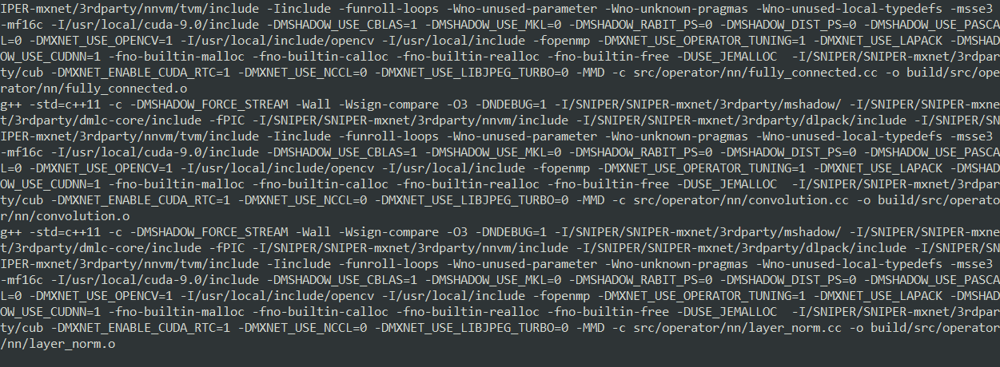
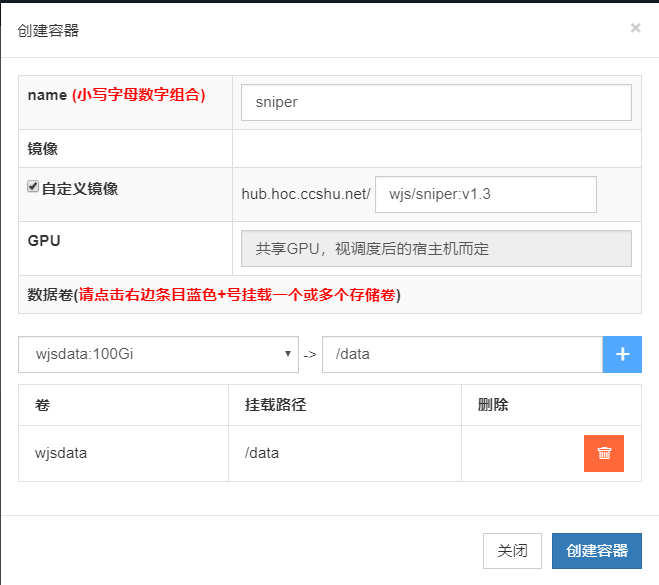
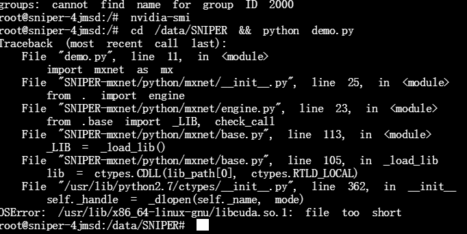

本文记录了如何在学校机器学习平台上创建一个基于Mxnet的Sniper镜像。

<!--more-->

# 说明

由于此镜像是用于学校机器学习平台,所以文中会出现FTP服务器等字眼,其实是在平台上使用镜像创建一个容器时,平台会**自动**将服务器上我所申请的文件存储区`mount`到创建的容器,我通过`FileZilla`FTP工具与在平台申请的文件存储区进行连接
​	
本文教程虽然有了一个FTP过程,但是如果是生成本地镜像,不考虑FTP,无视文中相关部分即可

**虽然本文中写了关于压缩的相关内容,但是最终并没有使用压缩,原因是由于压缩后出现未知问题,导致在平台上创建的容器不能使用宿主机的NVIDIA驱动,并不能成功运行Demo**

# 环境

本机环境
- windows 10 专业版
- docker client version 18.09.0
- docker server version 18.09.0
- FTP工具 FileZilla

平台环境
- docker version 17.06.2-ce

镜像环境
- python 2.7.12
- CUDA version 9.0.176
- pip 9.0.3

[SNIPER](https://github.com/mahyarnajibi/SNIPER)
[机器学习平台](http://10.0.4.228),这是学校资源

# 一 配置基础镜像

从学校机器学习平台上拉取原始镜像,因为这个镜像配好了一些基本的环境,如python2.x,CUDA9.0等等,所以直接使用它们的镜像作为基础镜像比较省心省力
`docker pull hub.hoc.ccshu.net/ces/deepo:all-py27-jupyter-ssh`

拉取到镜像之后,可以选择使用`Dockerfile`来生成我们需要的镜像,但是往往我们需要在镜像中添加许多库/包/插件,而且使用`Dockerfile`来生成镜像很容易出BUG.当然,最好的方式是使用`Dockerfile`,前提是你能确保`Dockerfile`文件中的每一行命令都不会出错.
在当前情况下,我选择使用从容器生成镜像的方法,这种方式会使得最终生成的镜像占内存巨大,但是可以在容器内部调试每一步配置过程.
使用`docker run -itd --name [name] hub.hoc.ccshu.net/ces/deepo:all-py27-jupyter-ssh`开启一个容器

使用`docker ps -a`查看正在运行的容器`ID`

使用`docker exec -it [name] /bin/bash`进入容器

在容器中使用`cat /etc/issue`命令查看容器的操作系统版本

结果输出: `Ubuntu 16.04.4 LTS \n \l`

## 安装 apt-file

安装`apt-file`

`apt-get install apt-file -y`

出现错误:


使用`apt-get install apt-file -y --fix-missing`同样不能解决问题

考虑**换源**

`cp /etc/apt/sources.list /etc/apt/sources.list.bak`备份系统原有的源

安装Linux下的文本编辑器`nano`,执行命令`apt-get install nano -y`
安装`nano`成功后,执行`nano /etc/apt/sources.list`修改源文件
在打开的文件中,将内容替换为
```
# deb cdrom:[Ubuntu 16.04 LTS _Xenial Xerus_ - Release amd64 (20160420.1)]/ xenial main restricted
deb-src http://archive.ubuntu.com/ubuntu xenial main restricted #Added by software-properties
deb http://mirrors.aliyun.com/ubuntu/ xenial main restricted
deb-src http://mirrors.aliyun.com/ubuntu/ xenial main restricted multiverse universe #Added by software-properties
deb http://mirrors.aliyun.com/ubuntu/ xenial-updates main restricted
deb-src http://mirrors.aliyun.com/ubuntu/ xenial-updates main restricted multiverse universe #Added by software-properties
deb http://mirrors.aliyun.com/ubuntu/ xenial universe
deb http://mirrors.aliyun.com/ubuntu/ xenial-updates universe
deb http://mirrors.aliyun.com/ubuntu/ xenial multiverse
deb http://mirrors.aliyun.com/ubuntu/ xenial-updates multiverse
deb http://mirrors.aliyun.com/ubuntu/ xenial-backports main restricted universe multiverse
deb-src http://mirrors.aliyun.com/ubuntu/ xenial-backports main restricted universe multiverse #Added by software-properties
deb http://archive.canonical.com/ubuntu xenial partner
deb-src http://archive.canonical.com/ubuntu xenial partner
deb http://mirrors.aliyun.com/ubuntu/ xenial-security main restricted
deb-src http://mirrors.aliyun.com/ubuntu/ xenial-security main restricted multiverse universe #Added by software-properties
deb http://mirrors.aliyun.com/ubuntu/ xenial-security universe
deb http://mirrors.aliyun.com/ubuntu/ xenial-security multiverse
```

这里使用的源是阿里的镜像站,也可以使用网易163的,源如下:
```
deb http://mirrors.163.com/ubuntu/ xenial main restricted universe multiverse
deb http://mirrors.163.com/ubuntu/ xenial-security main restricted universe multiverse
deb http://mirrors.163.com/ubuntu/ xenial-updates main restricted universe multiverse
deb http://mirrors.163.com/ubuntu/ xenial-proposed main restricted universe multiverse
deb http://mirrors.163.com/ubuntu/ xenial-backports main restricted universe multiverse
deb-src http://mirrors.163.com/ubuntu/ xenial main restricted universe multiverse
deb-src http://mirrors.163.com/ubuntu/ xenial-security main restricted universe multiverse
deb-src http://mirrors.163.com/ubuntu/ xenial-updates main restricted universe multiverse
deb-src http://mirrors.163.com/ubuntu/ xenial-proposed main restricted universe multiverse
deb-src http://mirrors.163.com/ubuntu/ xenial-backports main restricted universe multiverse
```

更改好源文件后,执行`sudo apt-get update`更新源

再次执行`apt-get install apt-file -y`,可以成功安装`apt-file`包

之后执行`apt-file update`更新apt-file cache
使用`apt-file find [name]`可以查找计算机上文件的位置,很方便
使用`apt-file search [name]`可以搜索缺少的库,解决文件缺失依赖
选择好自己需要的包,然后使用`apt-get install [name]`即可

- 如果需要把镜像上传到云上使用,有可能需要网络服务,
- 执行`apt-get install net-tools`安装ifconfig
- 执行`apt-get install iputils-ping`安装ping

此时为了避免诸如使用`ping [IP]`有效,但是`ping [HOST]`无效的情况,需要使用`nano /etc/resolv.conf`修改配置文件
将`namespace`后的IP地址更改为`8.8.8.8`或者`4.4.4.4`
*或者使用`echo "nameserver 114.114.114.114 > /etc/resolv.conf"`也可以*
退出保存即可

*有可能上述修改DNS的方式并不成功,原因是在云上运行容器时,配置文件自动修改,如果发生这种情况,请每次在新开一个容器时,手动修改配置文件的DNS服务器,使其可以使用网络服务*

# 二 安装编译依赖各种包

在电脑上空闲的地方,从Github拉取Sniper项目

`git clone --recursive https://github.com/mahyarnajibi/SNIPER.git`

- 因为我是在学校机器学习平台上运行docker容器,所以选择直接将clone下的文件上传至容器`mount`的ftp服务器,使用的软件是`FileZilla`

- 上传成功后可以在容器内通过`cd /data/[file or folder name]`进行访问

如果要在本地镜像内操作的话,也可以直接把本机文件或文件夹拷贝过去
`docker cp 本地文件路径 ID全称:容器路径`

---

`cd /data/SNIPER/SNIPER-mxnet`
`make USE_CUDA_PATH=/usr/local/cuda-9.0`
输出信息:


## 安装 jemalloc

选择安装`jemalloc`,这个工具可以加速编译,碎片整理,具体请自行谷歌
- `apt-get install autoconf`
- `apt-get install automake`
- `apt-get install libtool`
- `git clone https://github.com/jemalloc/jemalloc.git`
- `cd jemalloc`
- `git checkout 4.5.0`安装4.5.0版本的jemalloc,5.x版本的有坑,深坑
- `./autogen.sh`
- `make`
- `make install_bin install_include install_lib`,之所以不使用`make install`是因为会报错,如下: 

切换至`SNIPER-mxnet`文件夹,再次`make USE_CUDA_PATH=/usr/local/cuda-9.0`
虽然可以编译,但是有以下信息: 

强迫症必须搞定它,果断`ctrl+c`终止编译

## 安装 pkg-config

- 打开[https://pkg-config.freedesktop.org/releases/](https://pkg-config.freedesktop.org/releases/)
- 下载最新的,现在看到的是`pkg-config-0.29.2.tar.gz`
- 下载好之后,通过`FileZilla`等工具传输到FTP服务器
- 在容器内`cd`到压缩包位置
- `tar -xf pkg-config-0.29.2.tar.gz`
- `cd pkg-config-0.29.2`
- `./configure --with-internal-glib`,注意,中间是一个空格,非常关键
- `make && make install`


再次`make USE_CUDA_PATH=/usr/local/cuda-9.0`
算了，还是安装一下cudnn吧

## 安装 cudnn7.0
- [https://developer.nvidia.com/rdp/cudnn-archive](https://developer.nvidia.com/rdp/cudnn-archive) 下载cuDNN Libraries for Linux,不要下载 Power 8
- 把下载好的包上传到FTP服务器
- `cd`到包位置
- `cp cudnn-9.0-linux-x64-v7.solitairetheme8 cudnn-9.0-linux-x64-v7.tgz`
- `tar -xvf cudnn-9.0-linux-x64-v7.tgz`
- `cp include/* /usr/local/cuda-9.0/include`
- `cp lib64/* /usr/local/cuda-9.0/lib64`
- `chmod a+r /usr/local/cuda-9.0/include/cudnn.h /usr/local/cuda-9.0/lib64/libcudnn*`
- `export PATH=/usr/local/cuda-9.0/bin:$PATH`
- `cd`到`/usr/local/cuda-9.0/lib64`
- `nano ~/.bashrc`,关联环境变量
- 在最后一行加入`export LD_LIBRARY_PATH=/home/cuda/lib64:$LD_LIBRARY_PATH`
- `source ~/.bashrc`
- `ldconfig -v`
- 使用`cat /usr/local/cuda-9.0/include/cudnn.h | grep CUDNN_MAJOR -A 2` 查看cudnn版本


## 安装 OpenCV
- 使用`pkg-config opencv --modversion`查看
- 发现已经有OpenCV


## 安装 OpenBLAS
- `apt-get install libopenblas-dev`

## 编译 Mxnet

`make USE_CUDA_PATH=/usr/local/cuda-9.0`


**心好累,总共make了将近两个半小时**

编译`c++`文件`bash scripts/compile.sh`
这一步一定要在`/SNIPER/`文件夹下,不然贼坑,绝对不要`cd`到`/SNIPER/scripts`文件夹下再`bash compile.sh`,因为代码内有`cd lib/nms`等,如果不在`/SNIPER`文件夹下,会找不到文件

如果出现`syntax error near unexpected token `$'\r''`错误,可以使用`sed`命令将`\r`去掉,或者是在[Github](https://github.com/mahyarnajibi/SNIPER/blob/master/scripts/compile.sh)上将代码复制,使用`nano`编辑然后粘贴

可以使用`cat -v [filename]`查看
![]./create-sniper-docker-image/Snipaste_2019-01-03_16-33-27.png)
以`^M`结尾的代表你所处理的文件换行符是dos格式的`"\r\n"`

我选择第二种笨方法,因为涉及的代码并不多

执行结果:


## 安装 dos2unix

由于发现这种简单的复制粘贴方式并不能很好的解决,所以查了一些[相关资料](https://blog.csdn.net/lovelovelovelovelo/article/details/79239068)
选择使用`dos2unix`来转换

- `apt-get install dos2unix`
- `dos2unix [filename]`


问题解决啦

## 安装依赖

在`/SNIPER/`文件夹下`pip install -r requirements.txt`
一定要确保镜像内可以联网


## 测试Demo

- `bash download_sniper_detector.sh`,download_sniper_detector.sh
文件在`/SNIPER/scripts`文件夹下

- `cd .. && python demo.py`


**运行成功!!!**

# 三 生成镜像
- 使用`exit`退出容器
- 使用`docker ps -a`查看容器ID
- 使用`docker stop [ID]`停止容器
- 使用`docker commit -a "作者信息" -m "附带信息" [ID] [name]:[tag]`生成镜像,会返回一个`sha256`开头的长ID,这个就是生成的镜像ID
- 使用`docker images`查看生成的镜像
- 如果需要的话,使用`docker push [name]:[tag]`将刚刚生成的镜像推送到云上

# 四 压缩镜像

**压缩镜像非常麻烦,但是也是有方法的,目前大概三种方法**

1. 使用`Dockerfile`生成镜像
2. 这种方法需要让容器在运行状态,使用`docker export [ID] | docker import - [name]:[tag]`导出容器快照,并从快照生成镜像,这种方式可以大大压缩镜像,但是缺点是有可能会使得镜像中的环境变量、开放端口、默认进入命令改变或消失.使用这种方式时,最好在生成镜像之后,创建一个`Dockerfile`文件,`From`这个镜像,并添加端口和命令入口
3. 使用`docker-squash`压缩镜像,这个方法适用于Linux和Mac系统

目前可以运行的镜像是13.6G

`hub.hoc.ccshu.net/wjs/sniper:v1.1`
现在要对它进行压缩

## 第一步,移除镜像内的SNIPER文件夹,把其放到FTP服务器上去

- 开启一个容器`docker run -itd --name [name] [id]`
- 复制容器内文件到本地`docker cp [长ID]:[容器内路径] [本地路径]`,将放置在本地的文件夹上传至FTP服务器
- 进入容器`docker exec -it [name] /bin/bash`
- 删除容器内文件夹`/SNIPER/`,使用`rm -rf SNIPER`,**一定要小心使用**
- 退出容器`exit`

## 第二步,压缩镜像

压缩容器
`docker export [ID] | docker import - [name]:[tag]`

可以看到,镜像体积少了大约2个G


由于使用这种方法会使得镜像丢失部分信息,所以,创建一个新的`Dockerfile`,在其中添加缺失的信息

## 第三步,完善镜像

在任意位置新建`Dockerfile`
输入
```
FROM [name]:[tag]
EXPOSE 22
ENTRYPOINT ["/usr/sbin/sshd","-D"]
```


然后`docker build -t [name]:[tag] .`,不要忘了最后的`.`

## 第四步 Push

`docker push [name]:[tag]`

至此,所有配置以及完成
镜像在`hoc.hoc.ccshu.net`的私有仓库里
SNIPER文件夹放置在机器学习平台服务器`mount`的目录里

# 五 测试

- 在平台上创建容器


- 耐心等待创建完成


- 创建成功


- 测试结果

**测试失败**

**但是,使用未压缩的镜像测试成功**
