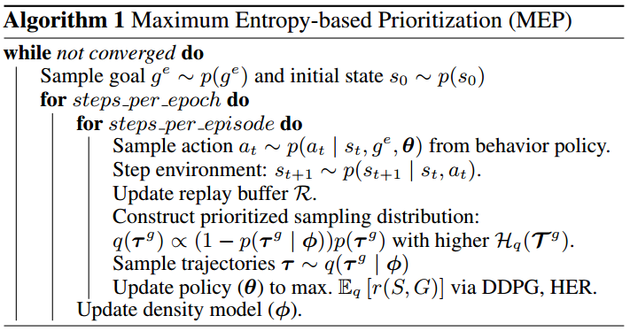

这篇论文将强化学习的目标与最大熵结合了起来，提出了简称为MEP的经验池机制。许多将熵与强化学习结合的方法都是考虑可选动作分布的熵，该篇论文很新颖的使用的是“迹”的熵。

推荐程度中等：

- 有些地方解释的不是很清楚
- 熵的结合方式特殊，可以一看
- 有些公式推导过于复杂，难懂

<!--more-->

# 简介

论文地址：[https://arxiv.org/pdf/1905.08786.pdf](https://arxiv.org/pdf/1905.08786.pdf)

原作者代码地址：[https://github.com/ruizhaogit/mep.git](https://github.com/ruizhaogit/mep.git)

该文章发于2019年的ICML，与之前写过的《Energy-Based Hindsight Experience Prioritization》为同一作者。

本文主要做了三个贡献：

1. 修改了目标函数，提出了最大熵正则化多目标强化学习(Maximum Entropy-Regularized Multi-Goal RL)的想法
2. 推导出替代(surrogate)目标函数，是第1步目标函数的一个下界，可以使算法稳定优化
3. 提出了Maximum Entropy-based Prioritization(MEP)的经验池框架

# 文中精要

文中目标函数的构造主要受Guiasu于1971年提出的加权熵(Weighted Entropy)启发。加权熵表示为：
$$
\mathcal{H}_{p}^{w}=-\sum_{k=1}^{K} w_{k} p_{k} \log p_{k}
$$
$w_{k}$表示权重。

## 多目标强化学习的符号表示

用$p\left(\boldsymbol{\tau} | g^{e}, \boldsymbol{\theta}\right)$表示一个迹出现的概率：

- $\boldsymbol{\tau}=s_{1}, a_{1}, s_{2}, a_{2}, \ldots, s_{T-1}, a_{T-1}, s_{T}$代表迹
- $g^{e}$代表一个真实的目标，即不是“事后诸葛亮”假定的目标，$g^{e} \in \operatorname{Val}\left(G^{e}\right)$，后一项为目标空间，一般情况下，可以视为状态空间$\mathcal{S}$的子集
- $\theta$代表策略参数

展开来写，一个迹在策略$\theta$被采样到的概率为
$$
p\left(\boldsymbol{\tau} | g^{e}, \boldsymbol{\theta}\right)=p\left(s_{1}\right) \prod_{t=1}^{T-1} p\left(a_{t} | s_{t}, g^{e}, \boldsymbol{\theta}\right) p\left(s_{t+1} | s_{t}, a_{t}\right)
$$
由此定义策略$\theta$下的期望奖励回报，也就是目标函数，表示为
$$
\begin{aligned} \eta(\boldsymbol{\theta}) &=\mathbb{E}\left[\sum_{t=1}^{T} r\left(S_{t}, G^{e}\right) | \boldsymbol{\theta}\right] \\ &=\sum_{g^{e}} p\left(g^{e}\right) \sum_{\boldsymbol{\tau}} p\left(\boldsymbol{\tau} | g^{e}, \boldsymbol{\theta}\right) \sum_{t=1}^{T} r\left(s_{t}, g^{e}\right) \end{aligned}
$$
很容易理解，也就是在传统的目标函数前边加了一项关于每个目标求积分的步骤。

如果使用off-policy算法且用经验池机制来提升采样效率，那么目标函数为
$$
\eta^{\mathcal{R}}(\boldsymbol{\theta})=\sum_{\boldsymbol{\tau}, g^{e}} p_{\mathcal{R}}\left(\boldsymbol{\tau}, g^{e} | \boldsymbol{\theta}\right) \sum_{t=1}^{T} r\left(s_{t}, g^{e}\right)
$$
其中$\mathcal{R}$表示经验池。

## 最大熵正则化目标函数

将前文提到的$\eta(\boldsymbol{\theta})$与加权熵结合起来，就构造出了本文中新的目标函数，即
$$
\begin{aligned} \eta^{\mathcal{H}}(\boldsymbol{\theta}) &=\mathcal{H}_{p}^{w}\left(\mathcal{T}^{g}\right) \\ &=\mathbb{E}_{p}\left[\color{red} {\log \frac{1}{p\left(\boldsymbol{\tau}^{g}\right)}} \sum_{t=1}^{T} r\left(S_{t}, G^{e}\right) | \boldsymbol{\theta}\right] \end{aligned}
$$
$\color{red} {p\left(\boldsymbol{\tau}^{g}\right)}$代表$\sum_{g^{e}} p_{\mathcal{R}}\left(\tau^{g}, g^{e} | \boldsymbol{\theta} \right )$，期望右下角的$p$也是$p\left(\boldsymbol{\tau}^{g}\right)$的意思。

**与传统的结合方式不同的是，这种结合方式并没有将熵作为一个加和的项，而是相乘。**

仔细想一下，如果将这个式子视为加权熵，那么权重系数是累计奖励$\sum_{t=1}^{T} r\left(s_{t}, g^{e}\right)$，这样做的直观解释是：**对于各种各样的迹，给与累计回报大的以更多权重，使算法直到要朝哪个迹的方向优化。**

反而，如果将前一个对数项视为传统强化学习目标函数的权重系数，那么这样的直观解释是：**迹出现的概率越低，就越新颖，反而要使其权重增加，从而驱使算法向探索的方向优化。**

## 伪代码

# 实验部分

未完待续