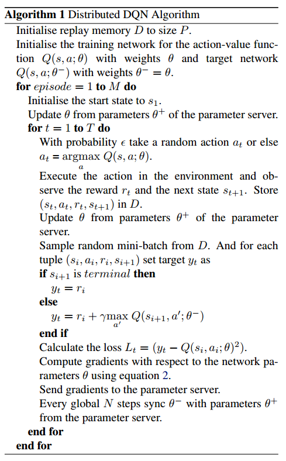
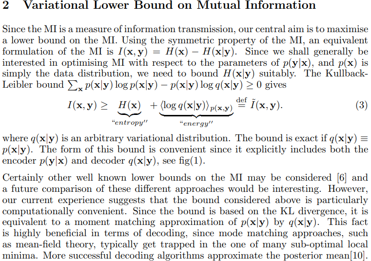
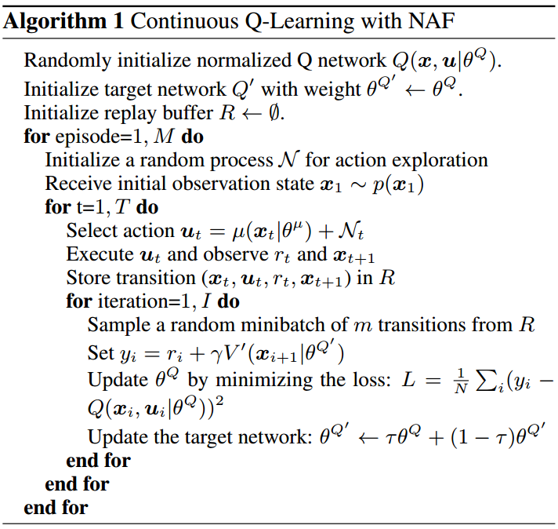

本文记录了一些粗读的强化学习相关的论文。

<!--more-->

<h1 align="center" style="color:blue" id="Gorila">[DeepMind]Massively Parallel Methods for Deep Reinforcement Learning[Gorila]</h1>

本文提出了一个分布式强化学习训练的架构：Gorila(General Reinforcement Learning Architecture)。2015年发于ICML，本文使用DQN算法进行分布式实现。

论文地址：[https://arxiv.org/pdf/1507.04296.pdf](https://arxiv.org/pdf/1507.04296.pdf)

## 模型示意图

解析：

- shard代表参数分片的意思，即模型过大、参数过多，需要将参数分片放置多台机器上
- Bundled Mode模式指的是Actor中的Q网络与Learner中的Q网络一样，但是Learner比Actor多了一个目标Q网络，用于计算梯度

## 特点

- 并行Actor采数据
- 并行Learner计算梯度，**不更新Learner中的模型**
- 中心参数服务器，用于维持最新的网络模型。如果模型太大、参数过多，可以分片将网络模型放置多个参数服务器，每个参数服务器中的参数独立不关联，根据learner传的梯度更新相应的变量
- 经验池机制，分为local与global两种
  - local，即每个actor节点一个经验池
  - global，将所有actor节点的经验存至一个分布式数据库中，这个**需要网络通信开销**

## 伪代码

解析：

- 伪代码中为一个actor节点的流程

- 注意伪代码中出现两次`Update θ from parameters θ+ of the parameter server `，这句话的意思为从中心参数服务器拉取模型到actor和learner，拉取的时间点为：

  - 每个episode开始前
  - 每次执行动作$a_{t}$后，但是在计算梯度并将梯度传递至参数服务器之前

- 伪代码中`equation 2`，代表$g_{i}=\left(r+\gamma \max _{a^{\prime}} Q\left(s^{\prime}, a^{\prime} ; \theta_{i}^{-}\right)-Q\left(s, a ; \theta_{i}\right)\right) \nabla_{\theta_{i}} Q(s, a ; \theta)$，这是DQN中的损失函数

- 注意，与传统DQN不同的是，**该分布式DQN中给Learner中的目标Q网络赋值时，是直接将更新N次的中心参数服务器中的模型进行拉取覆盖，而不是使用Learner中的Q网络**

- 中心参数服务器中的参数梯度更新需要累计多个learner传来的梯度后进行更新，使用异步SGD即ASGD方法进行梯度下降。

  - > The parameter server then applies the updates that are accumulated from many learners. 

- 因为每个actor都是阶段更新自己的模型，即从参数服务器中拉取。所以每个actor中的行为策略（采样策略）都不完全相同，事实上，每个actor节点可以采取不同的探索机制，这样可以更有效地探索环境

## 稳定性

为了应对节点退出、网速慢、节点机器运行慢等问题，该文章中指出使用了一个超参数用来控制actor和server之间最大延时。

- 过时的梯度（低于时间阈值）将会被丢弃

  - > All gradients older than the threshold are discarded by the parameter server. 

- 过高或过低的梯度也将被丢弃

  - > each actor/learner keeps a running average and standard deviation of the absolute DQN loss for the data it sees and discards gradients with absolute loss higher than the mean plus several standard deviations. 

- 使用AdaGrad更新规则

## 效果

采用于提出DQN的论文中一样的网络结构，具体请见论文中第5部分。

在Atari 2600 49个游戏中，41个明显优于单GPU DQN。

Gorila进一步实现了DRL的希望：一个可伸缩的架构，随着计算和内存的增加，它的性能会越来越好

<h1 align="center" style="color:blue" id="MB-MPO">[UCB/OpenAI]Model-Based Reinforcement Learning via Meta-Policy Optimization[MB-MPO]</h1>

论文地址：[https://arxiv.org/pdf/1809.05214.pdf](https://arxiv.org/pdf/1809.05214.pdf)

本文2018年发布于CoRL，提出了一个基于模型的元强化学习算法MB-MPO。相比于一般的元强化学习是从多个MDPs任务中学习一个通用模型加速以后特定任务的模型训练，该文中的方法是将一个model-free的任务学习多个不确定、不完全、不完美的动态模型，即一个模型集合，然后使用这个模型集合学习出该任务的通用模型。因为它有一个从model-free学习动态模型的过程，所以为model-based方法。

## 元强化学习

$$
\max _{\theta} \mathbb{E}_{\mathcal{M}_{k} \sim \rho(\mathcal{M}),\boldsymbol{s}_{t+1} \sim p_{k},\boldsymbol{a}_{t} \sim \pi_{\boldsymbol{\theta}^{\prime}}\left(\boldsymbol{a}_{t} | \boldsymbol{s}_{t}\right)}\left[\sum_{t=0}^{H-1} r_{k}\left(s_{t}, a_{t}\right)\right] \\ s.t.:\boldsymbol{\theta}^{\prime}=\boldsymbol{\theta}+\alpha\nabla_{\boldsymbol{\theta}} \mathbb{E}_{\boldsymbol{s}_{t+1} \sim p_{k},\boldsymbol{a}_{t} \sim \pi_{\boldsymbol{\theta}}\left(\boldsymbol{a}_{t} | \boldsymbol{s}_{t}\right)}\left[\sum_{t=0}^{H-1} r_{k}\left(s_{t}, a_{t}\right)\right]
$$

$\mathcal{M}$为一系列MDP，共享相同的状态空间$\mathcal{S}$与动作空间$\mathcal{A}$，但是奖励函数可以不同

## 学习环境动态模型

$$
\min _{\boldsymbol{\phi}_{k}} \frac{1}{\left|\mathcal{D}_{k}\right|} \sum_{\left(\boldsymbol{s}_{t}, \boldsymbol{a}_{t}, \boldsymbol{s}_{t+1}\right) \in \mathcal{D}_{k}}\left\|\boldsymbol{s}_{t+1}-\hat{f}_{\boldsymbol{\phi}_{k}}\left(\boldsymbol{s}_{t}, \boldsymbol{a}_{t}\right)\right\|_{2}^{2}
$$

解析：

- $\mathcal{D}_{k}$为第k个学习模型采样的“经验”

- $\phi$为用神经网络表示的环境模型的参数

- $\hat{f}_{\boldsymbol{\phi}_{k}}\left(\boldsymbol{s}_{t}, \boldsymbol{a}_{t}\right)$为第k个学习模型针对状态$s_{t}$执行动作$a_{t}$后转移状态的预测，其中，神经网络的输出不直接是预测的状态$\color{red}{s_{t+1}}$，而是$\color{red}{\Delta s=s_{t+1}-s_{t}}$，所以$\hat{f}_{\boldsymbol{\phi}_{k}}\left(\boldsymbol{s}_{t}, \boldsymbol{a}_{t}\right)=s_{t}+\Delta s$

  - > We follow the standard practice in model-based RL of training the neural network to predict the change in state $\Delta s=s_{t+1}-s_{t}$ (rather than the next state $s_{t+1}$) 

为了防止过拟合，文中使用了3个trick：

1. 早停
2. 归一化神经网络输入与输出
3. 权重归一化

## 基于环境动态模型的元强化学习

假设学到了K个近似模型$\left\{\hat{f}_{\phi_{1}}, \hat{f}_{\phi_{2}}, \ldots, \hat{f}_{\phi_{K}}\right\}$，把每个模型转换成一个MDP过程，即$\mathcal{M}_{k}=\left(S, A, \hat{f}_{\phi_{k}}, r, \gamma, p_{0}\right)$，其中，**奖励函数相同**

由此给每个学习到的动态模型分配的行为策略目标函数为：
$$
J_{k}(\boldsymbol{\theta})=\mathbb{E}_{\boldsymbol{a}_{t} \sim \pi_{\boldsymbol{\theta}}\left(\boldsymbol{a}_{t} | s_{t}\right)}\left[\sum_{t=0}^{H-1} r\left(\boldsymbol{s}_{t}, \boldsymbol{a}_{t}\right) | \boldsymbol{s}_{t+1}=\hat{f}_{\boldsymbol{\phi}_{k}}\left(\boldsymbol{s}_{t}, \boldsymbol{a}_{t}\right)\right]
$$
定义MB=MPO的最终目标函数为：
$$
\max _{\boldsymbol{\theta}} \frac{1}{K} \sum_{k=0}^{K} J_{k}\left(\boldsymbol{\theta}_{k}^{\prime}\right) \quad \text { s.t.: } \quad \boldsymbol{\theta}_{k}^{\prime}=\boldsymbol{\theta}+\alpha \nabla_{\boldsymbol{\theta}} J_{k}(\boldsymbol{\theta})
$$
小写k代表第k个学到的模型，大写K代表模型的总数。

注意看，这里公式后边使用的是$\color{red}{\theta'_{k}}$，而不是$\theta$。这里并没有写错，我起初以为写错了，具体请看后边的伪代码解释。

## 伪代码

解析：

- MB-MPO分为两部分更新，第一部分更新每个模型分配的行为策略，第二部分更新元策略。**注意：行为策略的更新是不连贯的，即不是自身迭代，而是不断使用元策略进行稍加修改然后替换，所以叫做adapted policy**
- 上一项提到的两次更新都是对元策略的参数$\theta$进行更新，区别是，第一次更新将更新后的参数赋值给了行为策略，未更改元策略本身，第二次更新直接更新元策略本身
- $\alpha, \beta$为两部分更新的学习率
- 行为策略使用VPG，即传统策略梯度算法进行优化，元策略使用TRPO算法进行优化
- 伪代码中的大致流程如下：
  1. 初始化策略$\pi_{\theta}$并将其复制K份$\pi_{\theta_{1}^{\prime}}, \dots, \pi_{\boldsymbol{\theta}_{K}^{\prime}}$
  2. 使用$\pi_{\theta_{1}^{\prime}}, \dots, \pi_{\boldsymbol{\theta}_{K}^{\prime}}$对**真实的环境模型进行采样（这一步是实际交互，即真实数据）**，将数据存入经验池
  3. 根据经验池训练K个环境模型，即使用`学习环境动态模型`部分的公式
  4. 对于每个更新后的环境模型，用元策略$\color{red}{\pi_{\theta}}$进行**虚拟采样（这一步是预测采样，即不实际进行交互）**，采样到$\mathcal{T}_{k}$以适应性修改行为策略$\boldsymbol{\theta}_{k}^{\prime}$。这里也是前边提到的行为策略更新是不连贯的原因。
  5. 再用适应性策略$\boldsymbol{\theta}_{k}^{\prime}$进行**虚拟采样**，采样到$\mathcal{T}_{k}^{\prime}$以更新元策略$\pi_{\theta}$
  6. 跳向第2步
- 伪代码中虽然没有明确指出，但是其实使用了baseline的trick用来减少方差

## 流程示意图

## 效果

1. 比之前的model-based方法效果好、收敛快
2. 可以达到model-free算法的渐进性能
3. 需要更少的经验，低采样复杂性。其实是使用了虚拟采样，提高了数据效率，减少了交互采样的代价。
4. 对于模型偏差（model-bias，即环境模型没学到位）的情况，之前的算法不能有效处理，该算法对不完美、不完全、不完整的模型具有很好地鲁棒性

<h1 align="center" style="color:blue" id="DIAYN">[UCB/Google AI]Diversity is All Your Need: Learning Skills Without a Reward Function[DIAYN]</h1>

论文地址：[https://arxiv.org/pdf/1802.06070.pdf](https://arxiv.org/pdf/1802.06070.pdf)

Google网页：[https://sites.google.com/view/diayn/home](https://sites.google.com/view/diayn/home)

Github项目：[https://github.com/ben-eysenbach/sac/blob/master/DIAYN.md](https://github.com/ben-eysenbach/sac/blob/master/DIAYN.md)

这篇文章使用信息论中最大熵的方法来构造强化学习的学习目标，**期望学习到具有多样性的技能（skills）**。

个人认为，此文章中所提的方法虽然很新颖，但是不能作为优化一项任务的可用算法，因为虽然其可以学到以各种花样完成目标，但是没有奖励函数的控制使得无法规范、指引智能体“解题”过程的效果，如柔顺性、实用性、实际可行性等。从另一方面来讲，将这样虽然不规划、不严谨决策行为的策略用于元策略的预训练模式还是可用的。

## 技能

技能的定义在文中有如下表述：

> A skill is a latent-conditioned policy that alters that state of the environment in a consistent
> way. 
> we refer to a/the policy conditioned on a fixed Z as a “skill” .

意思是，设定一个隐变量，以（状态$S$，隐变量$Z$）为条件进行动作选择，即为技能——skill。

DIAYN就好像是要给每个状态赋予各个不同技能的概率，并且使其中一个技能的概率最大，这样就使得在整个状态空间中，不同的技能“占领”着状态空间的不同部分，每个技能在各自偏好的局部状态空间中作用，但是作者同样希望每个技能在各自的状态空间中尽可能随机决策。

假设以不同的颜色代表不同的技能skill，每个方格代表一个状态，那么每个状态对于每个技能到达此状态的“偏好”概率是不同的。总的来说，作者希望技能之间的重合度尽可能小，但每个技能在各自的领域内尽可能随机地完成目标。

## 亮点与作用

1. 去掉了奖励函数
2. 修改了目标函数，$\mathcal{F}(\theta)\triangleq \mathcal{G}(\color{red}{\theta, \phi})$
   - $\color{red}{\theta}$代表Actor网络中的参数
   - $\color{red}{\phi}$代表Critic网络中的参数
3. 学习到的技能可以用于*分层强化学习、迁移学习、模仿学习*

## 目标函数

$$
\begin{aligned} 
\mathcal{F}(\theta) & \triangleq \color{red}{I(S ; Z)+\mathcal{H}[A | S]-I(A ; Z | S)} \\ 
&=(\mathcal{H}[Z]-\mathcal{H}[Z | S])+\mathcal{H}[A | S]-(\mathcal{H}[A | S]-\mathcal{H}[A | S, Z]) \\ 
&=\color{blue}{\mathcal{H}[Z]-\mathcal{H}[Z | S]+\mathcal{H}[A | S, Z]} \\
&=\mathcal{H}[A | S, Z]+\mathbb{E}_{z \sim p(z), s \sim \pi(z)}[\log p(z | s)]-\mathbb{E}_{z \sim p(z)}[\log p(z)] \\
&{ \color{orange}{\geq} \mathcal{H}[A | S, Z]+\mathbb{E}_{z \sim p(z), s \sim \pi(z)}\left[\log q_{\phi}(z | s)-\log p(z)\right] \\ 
\triangleq \mathcal{G}(\theta, \phi)}
\end{aligned}
$$

解析：

- 互信息，离散下为$I(X ; Y)=\sum_{y \in Y} \sum_{x \in X} p(x, y) \log \left(\frac{p(x, y)}{p(x) p(y)}\right)$，连续下为$I(X ; Y)=\int_{Y} \int_{X} p(x, y) \log \left(\frac{p(x, y)}{p(x) p(y)}\right) d x d y$

- 信息熵表示为$H(X, Y)=-\sum_{x, y} p(x, y) \log p(x, y)=-\sum_{i=1}^{n} \sum_{j=1}^{m} p\left(x_{i}, y_{i}\right) \log p\left(x_{i}, y_{i}\right)$

- 推到中频繁使用了性质$I(X,Y)=H(X)-H(X | Y)$

- 式中对数的底为自然指数$e$

- 看红色部分，化简之前：

  - **增大**：$I(S ; Z)$代表状态$S$与策略隐变量$Z$之间的互信息。因为作者希望可以通过策略所能到达的状态来判别其属于哪个技能，即将技能与状态挂钩。作者给出一个直观的解释：因为在有些状态下可以执行很多动作，但是却不改变环境（至少不明显改变），就像用机械手臂夹紧一个物体时，可使用力的大小、方向等都是很多的，不同技能选择不同动作导致的效果可能相同，所以作者不希望从动作的选择来区分学到的技能，而是通过可以明显观察到、数值化的状态$S$来作为区别不同技能的标准。**互信息$I(X,Y)$有一个直观的性质就是，它可以衡量两个随机变量的“相关性”，也就是说，互信息越大，代表知道$X$后对$Y$的不确定性减少，即知道其一可以加深对另一个的了解。**所以，目标函数希望最大化互信息$I(S ; Z)$，以将状态和技能相关联，使技能尽可能根据状态可以区分。
  - **增大**：$\mathcal{H}[A | S]$代表策略（不以隐变量$Z$区分技能，混合所有技能即为策略）的熵值。与SAC算法中想要使用熵增来使得动作的选择更加随机一样，作者希望随机性的动作同样可以完成目标，所以希望尽可能增大这一项。
  - **减小**：$I(A ; Z | S)$代表动作$A$与策略隐变量$Z$在给定状态$S$时之间的互信息。为了避免歧义，应该写作为$I[(A ; Z) | S]$。作者希望技能根据状态可区分，而不是根据动作，所以需要最小化这一项。

- 看蓝色部分，化简之后：

  - **固定最大，为$\ln n$**：$\mathcal{H}[Z]$代表技能分布的不确定性，既然要最大化这个项，不如就固定它，使得技能从其中均匀采样，使熵为最大值。
  - **减小**：$\mathcal{H}[Z | S]$代表状态$S$条件下技能的不确定性，我们知道，熵越大，不确定性越大；熵越小，不确定性越小。作者希望技能根据状态可区分，可以需要使这一项最小，以减小给定状态下所属技能的不确定性，使其尽可能接近概率1。
  - **增大**：$\mathcal{H [ A | S}, Z ]$代表给定技能$(S,Z)$下动作的不确定性。因为作者希望动作的选择尽可能随机但又可以完成目标，所以需要最大化这一项。

- 看橘色部分，使用Jensen不等式：

  - 这一步推导使用了论文[《The IM Algorithm : A variational approach to Information Maximization》](https://pdfs.semanticscholar.org/f586/4b47b1d848e4426319a8bb28efeeaf55a52a.pdf)中的推导公式
    $$
    I(\mathbf{x}, \mathbf{y}) \geq \underbrace{H(\mathbf{x})}_{\text { ‘‘entrop’’ }}+\underbrace{\langle\log q(\mathbf{x} | \mathbf{y})\rangle_{p(\mathbf{x}, \mathbf{y})}}_{\text { ‘‘energy’’ }} \stackrel{\mathrm{def}}{=} \tilde{I}(\mathbf{x}, \mathbf{y})
    $$

  - 

  - 蓝色公式中，有$I(Z;S) = \mathcal{H}[Z]-\mathcal{H}[Z | S]$，可以应用上述性质进行推导，将真实分布$p(z | s)$替换为任意变分分布(variational distribution)$q(z | s)$

  - 最后使用变分下界$\mathcal{G}(\theta, \phi)$代替目标函数$\mathcal{F}(\theta)$

- 至此，思路已经十分清晰。Actor网络以变量$\theta$参数化，并使用SAC算法($\alpha=0.1$)最大化$\mathcal{G}(\theta, \phi)$中$\mathcal{H}[A | S, Z]$部分；Critic网络以变量$\phi$参数化，并最大化后半个期望部分。文中将期望内的元素定义为“伪奖励”：
  $$
  r_{z}(s, a) \triangleq \log q_{\phi}(z | s)-\log p(z)
  $$
  由于$p(z)$为均匀分布，是固定的；对数函数不改变原函数单调性，所以只需最大化$q_{\phi}(z | s)$即可。

## 伪代码

解析：

- 每个episode都重新采样隐变量$z$
- Actor网络的输入为$(S||Z)$，即状态与隐变量的连结(我猜的= =)
- Critic网络的输入为状态$S$

## 模型示意图

解析：

- 隐变量分布$p(z)$是固定的

<h1 align="center" style="color:blue" id="CDP">Curiosity-Driven Experience Prioritization via Density Estimation[CDP]</h1>
论文地址：[https://arxiv.org/pdf/1902.08039.pdf](https://arxiv.org/pdf/1902.08039.pdf)

这篇文章发于2018年的NIPS，作者为赵瑞，之前读过他的两篇论文，并写了博客，可以在论文精读里找，此处不贴链接了，分别是基于能量的HER和最大熵正则化多目标RL。

这篇文章总的来说提出了**基于迹密度的优先经验回放**，人类的好奇心机制驱动他有了这样的想法，文中说受有监督学习使用过采样和降采样解决训练集样本不平衡问题的启发，想在强化学习中解决经验池中迹“不足（under-represented）”的问题。

说起来也挺佩服这个作者的，目前（2019年6月21日14:59:05）总共发了三篇关于强化学习的论文，但都有很好地结果：

1. 基于迹能量的优先级，发了CoRL
2. 基于迹密度的优先级，也就是这篇，发了NIPS
3. 基于迹最大熵的优先级，发了ICML

我个人道行尚浅，对于几篇论文中的深奥精髓有些不能尽数参透，由于先验知识不足，对于文中内容也不敢完全苟同，但是从这几篇阅读总结下来，发得了这种高级别论文有以下几个“加分性”要求：

1. 数学要好，这是必然的，数学公式写的越华丽，数学模型越复杂，当然越具有吸引力
2. 工作要专一且连续，看这三篇论文虽然不是递进关系，但都是在解决经验池优先相关的工作，所以找准一个领域内的小角度也是很重要的
3. 实验部分要做好，三篇都没用完整地、细节地比较各个算法，但是却新奇地比较了采样复杂性、数据利用率等等，总之，一定要用实验表明自己的方法在某方面有用
4. 其他秘密因素

## 流程

这篇论文的方法流程如下：

1. 计算**迹密度**$\rho$
2. 计算迹密度的补$\overline{\rho} \propto 1-\rho$
3. 根据补排序，并设置优先级，补越大优先级越大
4. 使用HER补充经验，设置相同的优先级和迹密度
5. 优化算法

## 迹密度的计算

这一部分没有看太懂，主要是本人数学功底比较薄弱，感兴趣的可以亲自查看论文中2.4与3.2.1、3.2.2部分。

根据文中的意思，思想大致如下：

1. 用GMM（高斯混合模型）来估计迹密度
   $$
   \rho(\mathbf{x})=\sum_{k=1}^{K} c_{k} \mathcal{N}\left(\mathbf{x} | \boldsymbol{\mu}_{k}, \boldsymbol{\Sigma}_{k}\right)
   $$

2. 在每个epoch，使用V-GMM（GMM的一个变体）+EM算法推断GMM参数($\boldsymbol{\mu}_{k}, \boldsymbol{\Sigma}_{k}$)的后验分布

3. 在每个episode，使用如下公式计算迹密度
   $$
   \rho=\mathrm{V}-\operatorname{GMM}(\mathcal{T})=\sum_{k=1}^{K} c_{k} \mathcal{N}\left(\mathcal{T} | \boldsymbol{\mu}_{k}, \boldsymbol{\Sigma}_{k}\right)
   $$
   其中，$\mathcal{T}=\left(s_{0}\left\|s_{1}\right\| \ldots \| s_{T}\right)$，**每个迹的长度相同**，中间的符号代表连结操作的意思，然后进行归一化
   $$
   \rho_{i}=\frac{\rho_{i}}{\sum_{n=1}^{N} \rho_{n}}
   $$

*注：我猜想上边符号表示的$s$其实包含了智能体的所在状态和要达到的真实目标，也就是$(s,g)$，文中有一段可能解释了这一部分，但是我没有太理解。*

## 优先级的设定

作者说使用rank-based方法来设置优先级，因为其受异常点影响小而具有良好的鲁棒性。

先计算迹密度的补
$$
\overline{\rho} \propto 1-\rho
$$
将补从小到大排序，并根据排名计算优先级，排名从0开始，即
$$
\operatorname{rank}(\cdot) \in\{0,1, \ldots, N-1\}
$$

$$
p\left(\mathcal{T}_{i}\right)=\frac{\operatorname{rank}\left(\overline{\rho}\left(\mathcal{T}_{i}\right)\right)}{\sum_{n=1}^{N} \operatorname{rank}\left(\left(\overline{\rho}\left(\mathcal{T}_{n}\right)\right)\right.}
$$

## 伪代码

解析：

- 每个epoch根据经验池中的样本数据重新拟合一次密度模型，也就是GMM中的参数
- 每个episode都计算其迹密度
- 红色框中的公式数字编号分别代表之间部分中关于计算迹密度和迹优先级的公式
- 采样迹、采样经验转换之后，需要采样目标并存入经验池，重构后的经验其优先级及迹密度与真正目标下迹的相同

## 优点

实验部分的比较详见论文。

1. 可以适用于任何Off-Policy算法
2. 不使用TD-error计算优先级，而使用迹密度，减少了计算时间
3. 提升了采样效率两倍左右
4. 算法性能超过最新算法9%（这个结果看看即可，不必放在心上）

<h1 align="center" style="color:blue" id="NAF">[Google]Continuous Deep Q-Learning with Model-based Acceleration[NAF]</h1>
论文地址：[https://arxiv.org/abs/1603.00748](https://arxiv.org/abs/1603.00748)

本文介绍了标准化优势函数Normalized Advantage Function——NAF算法，该算法简化了A-C架构，将Q-Learning的思想应用于高维连续空间。

本文的主要贡献是：

1. 提出NAF，简化了Actor-Critic架构
2. 将Q-Learning推广至高维连续空间
3. 提出新的与已学模型结合的方法，提升了采样复杂性（也就是降低）和学习效率，不牺牲策略的最优性。原文中翻译意思是，评估了几种将已学习模型与Q-Learning结合的方案，提出将局部线性模型与局部On-Policy想定推演结合以加速Q-Learning算法在model-free、连续问题下的学习

## 伪代码

解析：

- 。