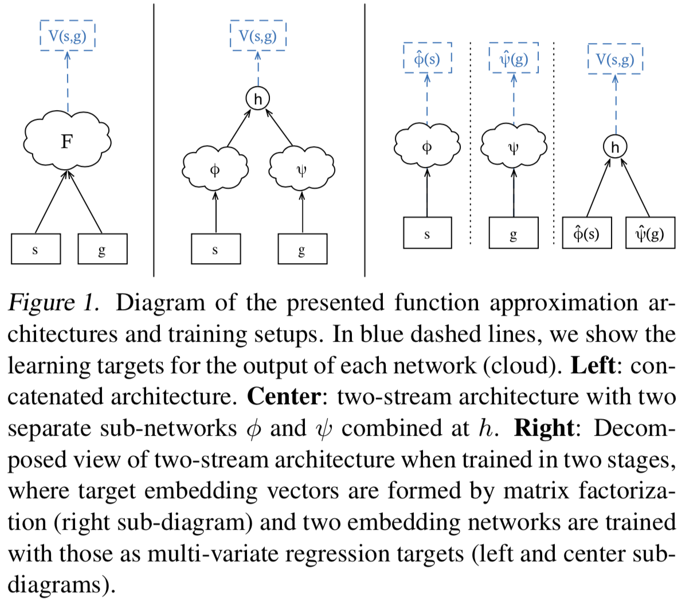

本文中的方法简称UVFA，即通用值函数逼近器，主要是用于将只能表示同一任务单目标的值函数表示成通用的多目标值函数。很多论文如HER都引用了这篇论文中提出的方法。

推荐程度中等：

- 文中理论说明很多，很晦涩，可以不看，直接跳至正文部分即可
- 思想简单，了解一下即可

<!--more-->

# 简介

论文地址：[http://proceedings.mlr.press/v37/schaul15.pdf](http://proceedings.mlr.press/v37/schaul15.pdf)

> Our main idea is to represent a large set of optimal value functions by a single, unified function approximator that generalises over both states and goals.

主要思想是通过一个统一的函数逼近器来表示一大组最优值函数，该函数逼近器可以概括状态和目标。

单目标中值函数这么表示：
$$
V_{g, \pi}(s) :=\mathbb{E}\left[\sum_{t=0}^{\infty} R_{g}\left(s_{t+1}, a_{t}, s_{t}\right) \prod_{k=0}^{t} \gamma_{g}\left(s_{k}\right) | s_{0}=s\right]
$$
动作值函数这么表示：
$$
Q_{g, \pi}(s, a) :=\mathbb{E}_{s^{\prime}}\left[R_{g}\left(s, a, s^{\prime}\right)+\gamma_{g}\left(s^{\prime}\right) \cdot V_{g, \pi}\left(s^{\prime}\right)\right]
$$
最优策略：
$$
\pi_{g}^{*}(s) :=\arg \max _{a} Q_{\pi, g}(s, a)
$$
相应的最优值函数：
$$
V_{g}^{*} :=V_{g, \pi_{g}^{*}} \ , \ Q_{g}^{*} :=Q_{g, \pi_{g}^{*}}
$$
本文中是想将一个单目标的最优值函数逼近改造成多目标的最优值函数表示，形象一点来说，就是把用向量表示状态值函数$V(s; \theta)$变成矩阵表示$V(s, g ; \theta)$，行列分别是状态$s$和目标$g$；把用矩阵表示动作值函数$Q(s, a; \theta)$变成三维Tensor表示$Q(s, a, g ; \theta)$，行列不变，增加维度-深度表示目标$g$。其中满足：
$$
V(s, g ; \theta) \approx V_{q}^{*}(s) \ , \ Q(s, a, g ; \theta) \approx Q_{a}^{*}(s, a)
$$

# 文中正文

该方法拟解决的问题：

- 如何通用表示各种问题的值函数逼近器？

主要思想：

- 用单个函数逼近器表示多目标的最优值函数

实现方法：

- 算法的输入由状态$s$扩展为状态-目标$\lt s,g \gt$，假设原状态表示向量$s$不包含目标信息

有两种实现形式：

- 直接用$||$连接，即$\left ( s||g \right )$，然后通过非线性函数逼近器(如MLPs)得到最终输出结果$V(s, g)$
- 分别embedding，并将嵌入后的表示通过运算得到**最终输出结果**(文中使用的是点积)，$h : \mathbb{R}^{n} \times \mathbb{R}^{n} \mapsto \mathbb{R}$，然后$V(s, g) :=h(\phi(s), \psi(g))$

左图为连结模式，中间图表示分别embedding并通过函数运算得到标量输出$h : \mathbb{R}^{n} \times \mathbb{R}^{n} \mapsto \mathbb{R}$，右图为中间图的细化。

文中指出，对于第二种形式，可以使$\phi$网络和$\psi$网络共享几层参数，因为一般来说，目标的向量表示形式与状态的向量表示形式相同，即$\mathcal{G} \subseteq \mathcal{S}$。如果对于对称问题，即奖励函数是$s$和$g$的距离(平方差)等形式，那么有特点：
$$
V_{g}^{*}(s)=V_{s}^{*}(g) \ , \ \forall s, g
$$
这个时候可以使$\phi$网络和$\psi$网络相同。

***注：文中提到有使用低秩因式分解分别表示$\hat{\phi}_{t}$和$\hat{\psi}_{g}$，并使用有监督学习训练两个网络对$s$和$g$的embediing($\phi_{t}$和$\psi_{t}$)进行训练的方法，但是这需要假设问题可进行因式分解，即有限的状态和目标，但这在实际应用中往往是不成立的，所以不对这部分做过多的关注。***

优点：

- UVFA可用于同任务多目标的迁移学习中，可以比随机值初始化更快地学习解决新任务。*这是显而易见的作用，毕竟本身就是多目标的通用函数逼近器。*
- 可以用于特征表示。*这也说，= =，强行增加字数。。。。。。*
- UVFA有效地提供了一个通用决策模型，代表（近似）朝向任何目标$g \in \mathcal{G}$的最佳行为。*这个优点与现在提出的元强化学习中的slow部分如出一辙。*

# 总结

UVFA把$V(s)$变成$V(s,g)$，一个可表示**单任务、多目标**的通用值函数近似，扩展对任务的知识表达。(通用即知识，哈哈)