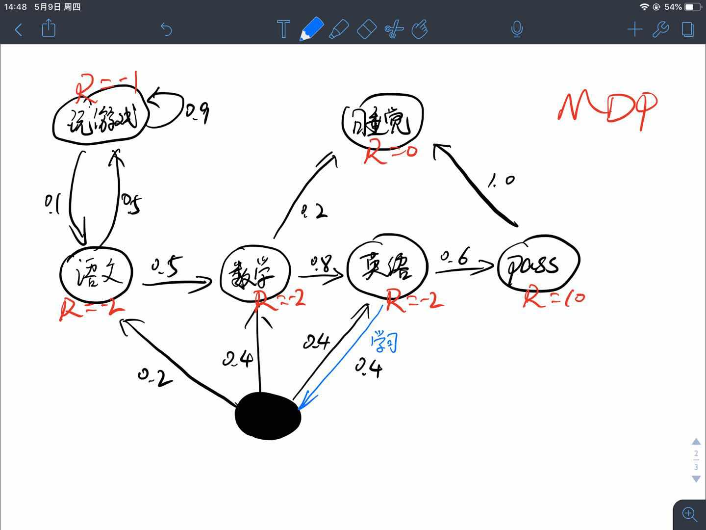

# 价值与贝尔曼方程

我们人在做决策的时候往往会判断做这件事的价值和后果，就像失恋了去喝不喝闷酒一样，不同的人有不同的选择，但是选择前肯定会判断这么做能给自己带来什么。

选择去喝酒的人觉得这可以缓解自己的痛苦，这就是判断喝酒这个动作的价值。因为身体原因不选择去喝酒的人觉得喝醉之后身体很不舒服，还会说胡话、闹事，这就是衡量后果、判断喝酒后状态的价值。

在乎过程的会根据动作的价值进行抉择，在乎结果的会根据状态的价值进行抉择。总之，衡量价值，毫无疑问是我们做决策的重要评判标准。

机器也一样，我们想教会机器学会自主决策，必然得让它们有一个价值导向，毕竟它可不会、也决不能像人一样"没有原因呀，就随便选择了一个而已"。

本文介绍了**绝大部分强化学习问题及算法**中值函数与贝尔曼方程的定义。因为有一些研究探索的，如好奇心、信息熵等方向的算法对值函数的定义有稍许不同。

---

注：以下公式及推导过程可能与其他博客、论文、书本上有稍许不同，不过都是经过细细分析，一步步推导的，或许有些公式难以理解，但都是尽可能细化每一处细节。使读者可以更清楚地了解每一个值的来龙去脉。

最不同的地方可能是在贝尔曼最优方程处，这里我尽可能的进行了展开。

---

## 值函数

值函数分为状态值函数与动作值函数，分别用来表示状态和状态下执行某动作的好坏程度、优劣程度。

回顾一下回报：
$$
\begin{align*}
G_{t} &\doteq R_{t+1}+\gamma R_{t+2}+\gamma^{2}R_{t+3}+\gamma^{3}R_{t+4}+...\\
&=R_{t+1}+\gamma (R_{t+2}+\gamma R_{t+3}+\gamma^{2}R_{t+4}+...)\\
&=R_{t+1}+\gamma (R_{t+2}+\gamma (R_{t+3}+\gamma R_{t+4}+...))\\
&=R_{t+1}+\gamma G_{t+1}
\end{align*}
$$

$$
G_{t}\doteq R_{t+1}+\gamma R_{t+2}+\gamma^{2}R_{t+3}+...=\begin{cases}
\sum_{k=0}^{\infty}\gamma^{k}R_{t+k+1}\\
\sum_{k=t+1}^{T}\gamma^{k-t-1}R_{k}
\end{cases}
$$

回顾一下之前的MDP例子：

将状态用符号表示为
$$
\begin{bmatrix}
玩游戏 & A\\ 
语文 & B\\ 
数学 & C\\ 
英语 & D\\ 
\mathcal{Pass} & E\\ 
睡觉 & F
\end{bmatrix}
$$
将转移概率矩阵$\mathcal{P}$写成如下形式

|        |  A   |  B   |  C   |  D   |  E   |  F   |
| :----: | :--: | :--: | :--: | :--: | :--: | :--: |
| Reward |  -1  |  -2  |  -2  |  -2  |  10  |  0   |
|   A    | 0.9  | 0.1  |      |      |      |      |
|   B    | 0.5  |      | 0.5  |      |      |      |
|   C    |      |      |      | 0.8  |      | 0.2  |
| D,0.4  |      | 0.2  | 0.4  | 0.4  |      |      |
| D,0.6  |      |      |      |      | 0.6  |      |
|   E    |      |      |      |      |      | 1.0  |

其中，D状态有两个动作，但是其0.4概率选到的动作并不一定确定地转移到另一个状态，所以将两个动作分开写，其实除了Reward的每一行都是一个$(s,a)$的状态-动作对，但是除了D状态有特殊外，其他状态的转移都是确定的，于是省略了动作。后续将会看到如果根据$(D,0.4)$这个状态-动作对去进行相应的计算。

### 状态值函数$V(s)$

$\pi$策略下$s$状态的价值函数可以表示为$v_{\pi}(s)$，由**期望回报**表示

$$
v_{\pi}(s) \doteq \mathbb{E}_{\pi}[G_{t}|S_{t}=s] = \mathbb{E}_{\pi}\left [ \sum_{k=0}^{\infty}\gamma^{k}R_{t+k+1}\mid S_{t}=s \right ], \ for \ all \ s\in S
$$

有了这个公式，我们能根据上述表格计算出每个状态的价值吗？当然可以，只是很麻烦，如果对于连续状态空间的问题就不只是麻烦的问题，而是不能计算。

为什么呢？因为要求期望需要遍历所有可能性的episode，连续状态空间根本无法遍历所有的情况。

### 动作值函数$Q(s,a)$

动作值函数与状态值函数在公式表示上差别不大，$\pi$策略$s$状态下执行a动作的价值函数可以表示为$Q_{\pi}(s，a)$，由**期望回报**表示
$$
Q_{\pi}(s,a) \doteq \mathbb{E}_{\pi}[G_{t}|S_{t}=s,A_{t}=a] = \mathbb{E}_{\pi}\left [ \sum_{k=0}^{\infty}\gamma^{k}R_{t+k+1}\mid S_{t}=s,A_{t}=a \right ]
$$

## 贝尔曼方程

> [贝尔曼方程（Bellman Equation）(百度百科)](https://baike.baidu.com/item/贝尔曼方程/5500990?fr=aladdin)也被称作动态规划方程（Dynamic Programming Equation），由理查·贝尔曼（Richard Bellman）发现。
>
> 贝尔曼方程是动态规划（Dynamic Programming）这些数学最佳化方法能够达到最佳化的必要条件。此方程把“决策问题在特定时间怎么的值”以“来自初始选择的报酬比从初始选择衍生的决策问题的值”的形式表示。借此这个方式把动态最佳化问题变成简单的子问题，而这些子问题遵守从贝尔曼所提出来的“最佳化还原理”。

**贝尔曼方程将状态值函数$V(s)$与动作值函数$Q(s,a)$、将当前的值函数与之后状态$V(s‘)$或动作的值函数$Q(s’,a‘)$联系起来。**

### 状态值函数$V(s)$与动作值函数$Q(s,a)$的关系

$$
v_{\pi}(s)=\sum_{a}\pi(a\mid s) q_{\pi}(s,a)
$$

$$
q_{\pi}(s,a) = \sum_{s',r}p(s',r \mid s,a)\left[r+\gamma v_{\pi}(s')\right]
$$

### 贝尔曼期望方程

状态值函数$V(s)$可以写成如下形式：
$$
\begin{align*}
v_{\pi}(s) & \doteq \mathbb{E}_{\pi}\left [ G_{t}\mid S_{t}=s \right ]\\
&=\mathbb{E}_{t} \left [R_{t+1}+\gamma G_{t+1} \mid S_{t}=s \right]\\
&=\sum_{a}\pi(a\mid s)\sum_{s'}\sum_{r}p(s',r\mid s,a)\left[r+\gamma \mathbb{E}\left[G_{t+1}\mid S_{t+1}=s' \right]\right]\\
&=\sum_{a}\pi(a\mid s)\sum_{s',r}p(s',r \mid s,a)\left[r+\gamma v_{\pi}(s')\right]\\
&=\sum_{a}\pi(a\mid s) q_{\pi}(s,a)
\end{align*},
for \ all \ s\in S
$$

看到没有，此时可以将当前状态的状态值$v_{\pi}(s)$与下一个可到达状态的状态值$v_{\pi}(s')$联系起来，这时候就可以想到，对呀，我们可以从终态倒着计算，这样循环迭代下去总比要从始态列出大量的episode可要强多了吧！

动作值函数$Q_{\pi}(s,a)$也可以进行类似推导：
$$
\begin{align*}
q_{\pi}(s,a) & \doteq \mathbb{E}_{\pi}\left [ G_{t}\mid S_{t}=s,A_{t}=a \right ]\\
&=\mathbb{E}_{t} \left [R_{t+1}+\gamma G_{t+1} \mid S_{t}=s,A_{t}=a \right]\\
&=\sum_{s',r}p(s',r\mid s,a)\left[r+\gamma \sum_{a'}\pi(a'\mid s') \mathbb{E}\left[G_{t+1}\mid S_{t+1}=s',A_{t+1}=a' \right]\right]\\
&=\sum_{s',r}p(s',r \mid s,a)\left[r+\gamma \sum_{a'}\pi(a'\mid s') q_{\pi}(s',a')\right]\\
&=\sum_{s',r}p(s',r \mid s,a)\left[r+\gamma v_{\pi}(s')\right]
\end{align*}
$$

### 最优值函数

最优状态值函数：

$$
v_{*}(s)=\max_{\pi} v_{\pi}(s)
$$

最优动作值函数：

$$
q_{*}(s,a)=\max_{\pi} q_{\pi}(s,a)
$$

### 贝尔曼最优方程

$$
\begin{align*}
v_{*}(s) &= \max_{a} q_{*}(s,a)\\
&=\max_{a}\max_{s',r}\left[r+\gamma v_{*}(s'\mid s,a)\right]
\end{align*}
$$

$$
\begin{align*}
q_{*}(s,a) &= \max_{s',r}\left[r+\gamma v_{*}(s')\right]\\
&=\max_{s',r} \left[r+\gamma \max_{a'} q_{*}(s',a')\right]
\end{align*}
$$

## 例子
未完待写
